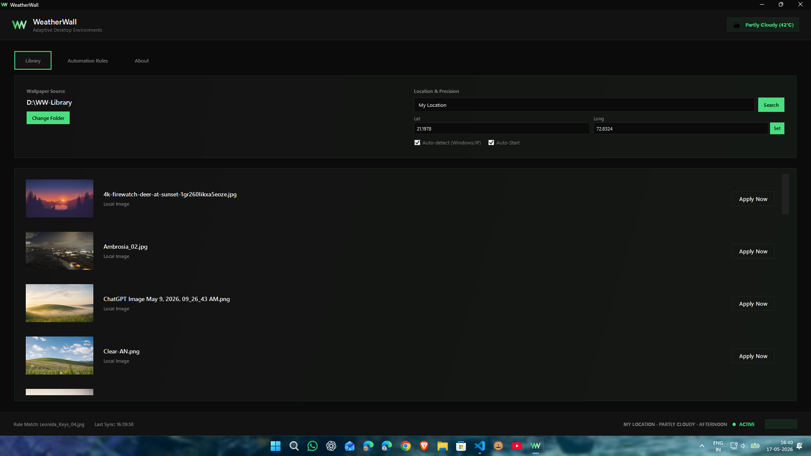
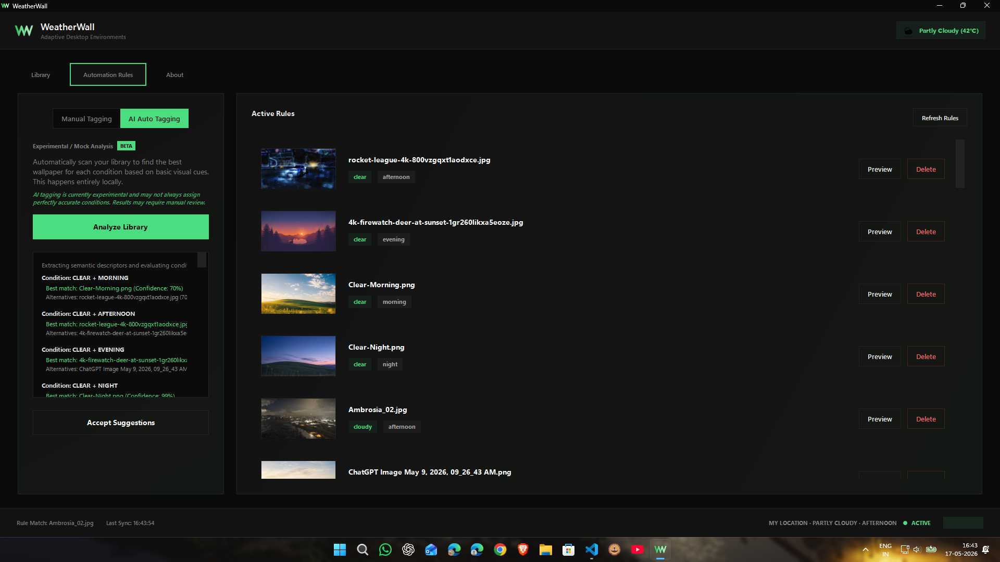

# WeatherWall v1.2.0

WeatherWall is a lightweight native Windows utility that automatically synchronizes your desktop wallpaper with real-time weather conditions and local time.

Built for desktop customization enthusiasts who want their setup to feel dynamic, atmospheric, and alive.

---

## ✨ Features

- 🌦️ **Weather-Adaptive Wallpapers**  
  Automatically switches wallpapers based on:
  - clear
  - cloudy
  - rainy
  - foggy
  - stormy
  - overcast
  - snowy *(experimental)*

- 🕒 **Time-Aware Environments**  
  Supports:
  - morning
  - afternoon
  - evening
  - night

- 📍 **Location-Based Synchronization**  
  Uses local weather and sunrise/sunset timing to improve atmosphere matching.

- ⚡ **Lightweight Background Utility**  
  Optimized for extremely low RAM and CPU usage while running in the system tray.

- 🖥️ **Minimal Native UI**  
  Sharp black/green desktop-native interface with a clean minimal design language.

- 🎞️ **Smooth Wallpaper Transitions**  
  Improved fullscreen fade transitions without aggressive desktop flashing.

- 🤖 **Experimental AI Auto Tagging (BETA)**  
  Local experimental AI-assisted wallpaper analysis and tagging system.  
  *(Still under development and may require manual review.)*

- 🚀 **Standalone Windows Build**  
  No complicated installation process required.

---

# 📸 Interface





---

## 📦 Download

Pre-built standalone releases are available on the [Releases](../../releases) page.

---

## ⚙️ System Requirements

- Windows 10 or later
- .NET Runtime 8.0 *(included in release builds)*
- Internet connection for weather synchronization

---

# 💻 Building From Source

## Prerequisites

- Visual Studio 2022  
or
- Visual Studio Code with C# extension

Required:
- .NET 8.0 SDK
- Windows 10/11

---

## Clone Repository

```bash
git clone https://github.com/MayankArambhi/WeatherWall.git
cd WeatherWall