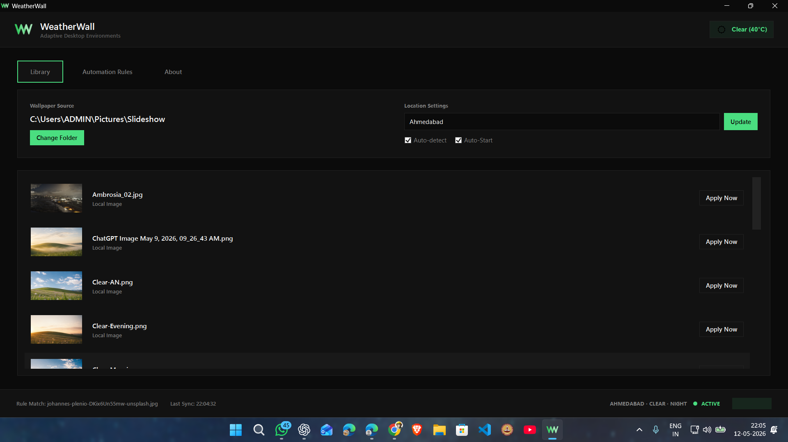
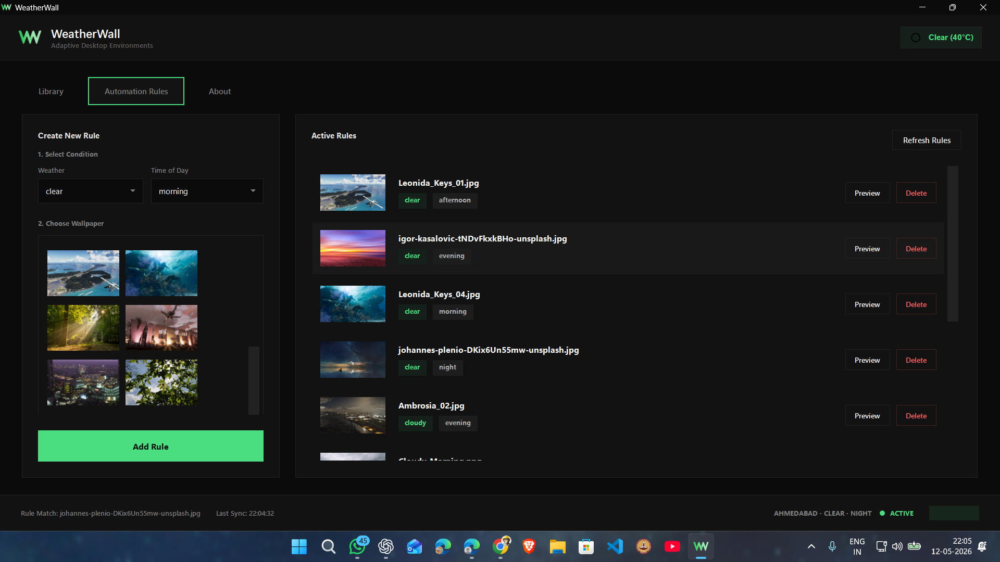

# WeatherWall

WeatherWall is a sophisticated Windows utility that automatically synchronizes your desktop wallpaper with real-time weather conditions and the time of day.

## 🎯 For End Users

### Download
Pre-built releases are available on the [Releases](../../releases) page.

### Features
- **Adaptive Environments**: Auto-switches wallpapers based on weather (clear, cloudy, rainy, foggy, stormy)
- **Time-Aware**: Morning, afternoon, evening, and night themes
- **Smooth Transitions**: Flicker-free fullscreen fade transitions
- **Modern UI**: Windows 11-inspired interface with Light/Dark mode
- **Lightweight**: Minimal system resources, runs quietly in system tray
- **Auto-Start**: Optional background launching on startup

---

## Interface:




---

### System Requirements
- Windows 10 or later
- .NET Runtime 8.0 (included in release downloads)
- Active internet connection for weather updates

---

## 💻 For Developers

### Building From Source

**Prerequisites:**
- Visual Studio 2022 or Visual Studio Code with C# extension
- .NET 8.0 SDK
- Windows 10/11

**Build Steps:**
```bash
git clone https://github.com/MayankArambhi/WeatherWall.git
cd WeatherWall
dotnet build -c Release
```

**Output:** Built executable will be in `bin/Release/net8.0-windows/win-x64/`

### Project Structure
```
WeatherWall/
├── App.xaml                 # Application configuration
├── MainWindow.xaml          # Main UI
├── SplashWindow.xaml        # Splash screen
├── config.json              # User configuration
├── WeatherWall.csproj       # Project file
├── WeatherWall.sln          # Solution file
└── WW/                      # Resources (icons, images)
```

### Technologies
- **WPF** (Windows Presentation Foundation) for UI
- **.NET 8** (Windows Desktop Targeted)
- **Windows Forms** for system tray integration

### Creating a Release Build
```bash
dotnet publish -c Release -r win-x64 --self-contained
```

---

## 🤝 Contributing

Contributions are welcome! Please feel free to submit a Pull Request.

## 👤 Author

**Mayank Arambhi**

---

*For feature requests and bug reports, please use the [Issues](../../issues) tab.*
